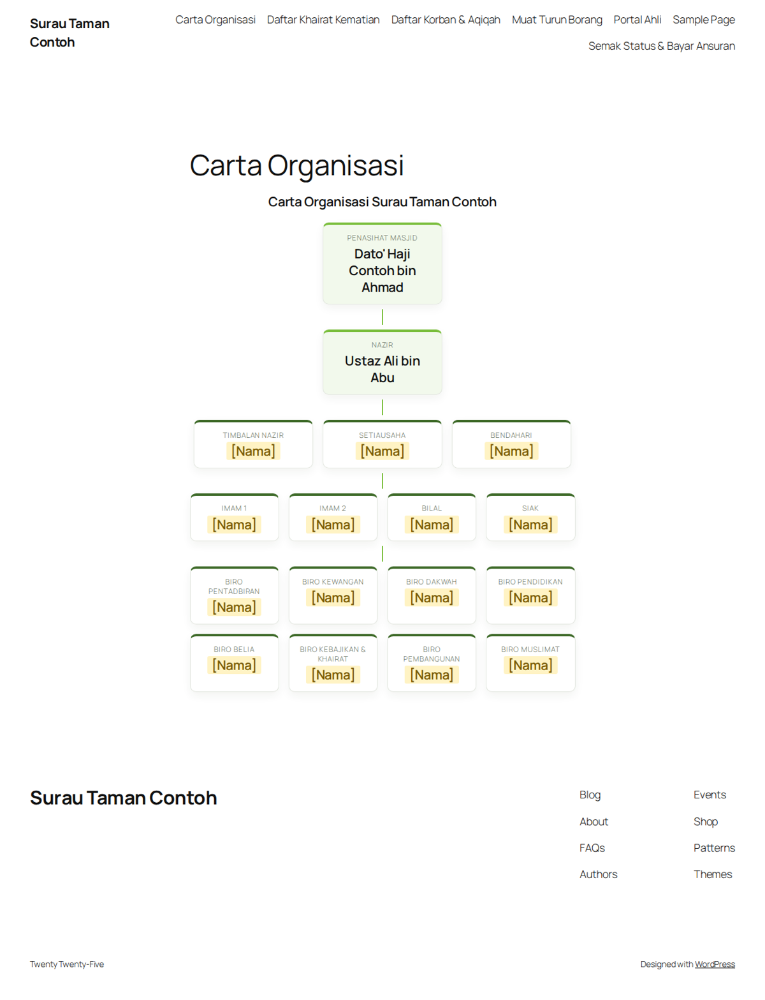
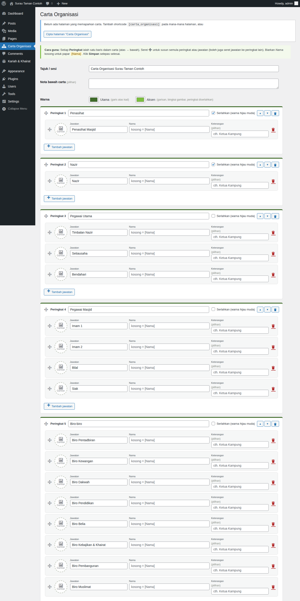

# Carta Organisasi Masjid

Plugin WordPress untuk memaparkan **carta organisasi masjid / surau** yang boleh dikemas kini sendiri oleh AJK — tanpa menyentuh HTML.

*A WordPress plugin for mosque committees to maintain their organisation chart from wp-admin (drag & drop, photos, live preview, version history). UI is in Bahasa Melayu.*



## Ciri-ciri

- **Editor seret & lepas** — susun peringkat (baris) dan jawatan; jawatan boleh diseret ke peringkat lain
- **Gambar** dari Media Library (bulat, dipotong automatik); peringkat tanpa gambar kekal kemas
- **Pratonton langsung** semasa menaip, amaran perubahan belum disimpan
- **Serlahkan** peringkat penting (cth. Penasihat, Nazir)
- **Warna** utama & aksen boleh ditukar supaya sepadan dengan logo masjid
- **Sejarah versi** — 15 simpanan terakhir, boleh dipulihkan dengan satu klik
- **Templat asas** masjid Malaysia (Penasihat → Nazir → Pegawai Utama → Imam/Bilal/Siak → Biro)
- Responsif (2 kad sebaris di telefon), berfungsi dengan tema klasik dan tema blok
- Kemas kini automatik dari GitHub Releases



## Pemasangan

1. Muat turun **`carta-organisasi.zip`** dari halaman [Releases](../../releases/latest).
2. wp-admin → **Plugins → Add New → Upload Plugin** → pilih zip → **Install Now** → **Activate**.
3. Buka menu **Carta Organisasi**, isi nama dan gambar, klik **Simpan carta**.
4. Klik **Cipta halaman "Carta Organisasi"** (atau letak shortcode `[carta_organisasi]` pada mana-mana halaman), kemudian tambah halaman itu ke menu.

Kemas kini seterusnya akan muncul di **Dashboard → Updates** seperti plugin biasa.

## Siapa boleh mengemas kini?

Administrator dan Editor (keupayaan `edit_pages`). Untuk menukar:

```php
add_filter( 'pc_capability', fn() => 'manage_options' );
```

## Keperluan

WordPress 5.8+ · PHP 7.4+

## Menyahpasang

Nyahaktif tidak memadam apa-apa. **Padam** plugin akan membuang data carta (gambar kekal dalam Media Library).

## Lesen

GPL-2.0-or-later © Mohd Nordin Hussain
